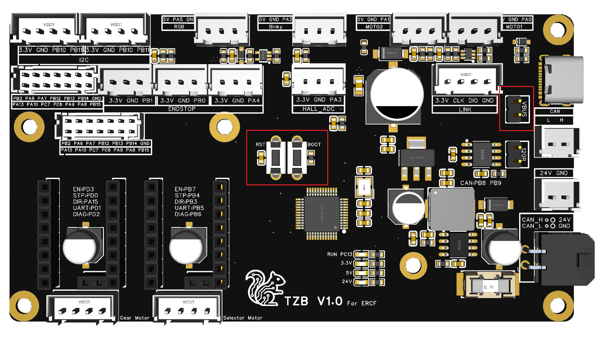

# TZB V1 Mainboard Manual

English | [中文](README_CN.md)


---

## Table of Contents

- [1. Introduction](#1-introduction)
- [2. PIN Diagram](#2-pin-diagram)
- [3. Flashing Guide](#3-flashing-guide)
  - [3.1. Flashing Katapult (Optional)](#31-flashing-katapult-optional)
  - [3.2. Compiling Klipper Firmware](#32-compiling-klipper-firmware)
  - [3.3. Updating Firmware via Katapult](#33-updating-firmware-via-katapult)
  - [3.4. Updating Firmware via DFU](#34-updating-firmware-via-dfu)
- [4. ERCF Wiring Diagram](#4-ercf-wiring-diagram)
- [5. Happy Hare Software Configuration](#5-happy-hare-software-configuration)
- [6. I2C Temperature and Humidity Configuration](#6-i2c-temperature-and-humidity-configuration)

---


## 1. Introduction

The **TZB V1 Mainboard** is a dedicated mainboard developed for the ERCF.

It has the following features:

- Main chip uses STM32G0B1CBT6 MCU
- Supports both USB serial and CAN interface connections
- 2 motor slots based on TMC2209 in UART mode, supporting sensorless homing (Diag)
- The 5V interface can provide a large current of 5A, with optimized inductor and capacitor heat dissipation to ensure sufficient and stable power for servos and LEDs
- Two mirrored 2x7P XHD2.0 connectors, convenient for paralleling the two sets of microswitches in ERCF V3, simplifying wiring
- All silkscreen labels are on the front for ease of use
- 1 x RGB LED connector
- 2 x Servo connectors, capable of driving a remote cutter
- 1 x Binky encoder connector
- 16 x Microswitch control connectors, which can support up to a 16-color ERCF if fully utilized
- 1 x I2C interface, using a hardware I2C port, which can be used to connect a temperature and humidity sensor
- 1 x 24V GND connector, which can be used to supply power to remote cutters that require more than 5V
- 1 x External CAN connector, which can be used to connect other mainboards in parallel, such as a passive enclosure mainboard
- 1 x ADC interface, for use with a linear ratio synchronous buffer using an analog Hall effect sensor


## 2. PIN Diagram

The wiring diagram for this mainboard is entirely on the front, making it clear at a glance without needing a separate pinout diagram.


## 3. Flashing Guide

### 3.1 Flashing Katapult (Optional)

Users who only use a CAN connection and want the convenience of quick firmware updates by pressing the Reset button can choose to flash Katapult (formerly known as Canboot).

Katapult is not mandatory, regardless of whether you use a CAN or USB connection.

```bash
# Go to the home directory
cd ~
 
# Download katapult (skip if you already have it)
git clone https://github.com/Arksine/katapult
 
# Enter the katapult directory
cd katapult
```


```
# Clean the previous build
make clean
 
# Modify the build configuration, fill in the parameters as shown in the image below
make menuconfig
 
# After verifying the settings, press q to exit, select y, then type make to start compiling
make
```


> [!TIP]
> The speed can be set according to your needs, 1000000 is recommended.


After compilation, katapult.bin will be generated in the ~/katapult/out folder.


**Entering DFU Mode**

Use a jumper to short the 5V USB pins. After shorting, you can power the board via USB for flashing. 

**Remember to remove the jumper after flashing is complete.**

If you are using 24V to power the board, you do not need to short the jumper, but you can only use Method 2 below to enter DFU mode.


- **Method 1 to enter DFU:** With the board completely powered off, press and hold the Boot button, connect the board to the host computer with a Type-C cable, then release the Boot button.

- **Method 2 to enter DFU:** If the board is powered on, connect it to the host computer with a Type-C cable, then press and hold the Boot button, press and release the Reset button, release the Reset button, and finally release the Boot button.

Then use the lsusb command to check if a DFU device is present.


```
lsusb
```


Use the following command to flash the board:

```
make flash FLASH_DEVICE=0483:df11
```


After flashing is complete, please unplug the USB cable and connect the CAN signal cable and 24V power supply.

> [!NOTE]

> 1: Remember to remove the 5V USB jumper.

> 2: If you have multiple CAN devices, you only need to short the 120-ohm resistor on one device. It is best to short the 120-ohm resistor on the mainboard at the end of the chain.

> 3: Pay close attention to the wiring order of 24V, GND, CAN-H, and CAN-L. Double-check carefully. Incorrect wiring may cause the mainboard to burn out, and you will be responsible for the consequences.


Use the following command to check the CAN UUID. **[You may need to quickly double-press the reset button to enter the bootloader]**

```
~/klippy-env/bin/python ~/klipper/scripts/canbus_query.py can0
```


### 3.2 Compiling Klipper Firmware

SSH into your host machine.

```
# cd to the klipper directory
cd ~/klipper
 
# Clean the previous build
make clean
 
# Configure the build parameters [refer to the image below]
make menuconfig
```


Set the build parameters according to the protocol you need to use.


```
# If not using Katapult
Bootloader offset (No bootloader) --->
 
# If using Katapult
Bootloader offset (8KiB bootloader) --->
 
# If using USB communication via Type-C
Communication interface (USB (on PA11/PA12)) --->
 
# If using CANBus communication
Communication interface (CAN bus (on PD0/PD1)) --->
 (1000000) CAN bus speed
```

Press `q` to exit, and `y` to save.


Enter the make command to start compiling.

```
make
```


### 3.3 Updating Firmware via Katapult

Connect the CAN signal cable and 24V power supply.

> [!NOTE]

> 1: Remember to remove the 5V USB jumper.

> 2: If you have multiple CAN devices, you only need to short the 120-ohm resistor on one device.

> 3: Pay close attention to the wiring order of 24V, GND, CAN-H, and CAN-L. Double-check carefully. Incorrect wiring may cause the mainboard to burn out, and you will be responsible for the consequences.


Then use the following command to check the UUID:

```
~/klippy-env/bin/python ~/klipper/scripts/canbus_query.py can0
```


Use the following command to flash in CAN mode:

```
cd ~/katapult/scripts
 
python3 flashtool.py -i can0 -f ~/klipper/out/klipper.bin -u your_uuid_here
```


Then continue to use the previous command to check the CAN information.


**To upgrade the CAN firmware in the future, repeat this process. When compiling the Katapult firmware earlier, we set it to enter Katapult mode by double-pressing the reset button.**

**In practice, you can also directly enter the flashing command, and the board will automatically restart and enter Katapult.**

### 3.4 Updating Firmware via DFU

1: Enter DFU mode.

Use a jumper to short the 5V USB pins. After shorting, you can power the board via USB for flashing. 

**Remember to remove the jumper after flashing is complete.**

If you are using 24V to power the board, you do not need to short the jumper, but you can only use Method 2 below to enter DFU mode.





**Method 1 to enter DFU: **With the board completely powered off, press and hold the Boot button, connect the board to the host computer with a Type-C cable, then release the Boot button.

**Method 2 to enter DFU: **If the board is powered on, connect it to the host computer with a Type-C cable, then press and hold the Boot button, press and release the Reset button, release the Reset button, and finally release the Boot button.

2: In SSH, type lsusb to check if a DFU device appears. Normally, a DFU device should appear.

If no DFU device appears, repeat the operation.


3: In SSH, enter:

```
# Make sure you are in the klipper directory
cd ~/klipper
 
# 0483:df11 is the ID found with lsusb earlier
# If it says make not found, install it with sudo apt install dfu-util -y
 
make flash FLASH_DEVICE=0483:df11
```

The flashing process will then begin [you may need to enter your password]. Wait for the progress bar to complete. When "successfully" appears, it means the flashing was successful.

You can ignore any errors that appear after "successfully".


Flashing is complete.

4: **Get the serial ID**

Unplug and replug the USB data cable, use lsusb to check if there is an stm32f446 device.

Use the following command to check the device's serial ID:

```
ls /dev/serial/by-id/
```


The serial ID for this device is:

```
serial: /dev/serial/by-id/usb-Klipper_stm32g0b1xx_20003A00025030544E383020-if00
```

**For later use, please remove the 5V USB jumper and connect 24V power to the CAN interface.**


## 4. ERCF Wiring Diagram


## 5. Happy Hare Software Configuration

After installation, you need to go to the mmu/base/mmu.cfg file to modify the pin-related content. Copy the content below and overwrite the corresponding section [compatible with HH3.2 and above versions].

HappyHare adaptation is in progress.

```
#TZB V1.0
[board_pins mmu]
mcu: mmu # Assumes using an external / extra mcu dedicated to MMU
aliases:
    MMU_GEAR_UART=PD1,
    MMU_GEAR_STEP=PD0,
    MMU_GEAR_DIR=PA15,
    MMU_GEAR_ENABLE=PD3,
    MMU_GEAR_DIAG=PD2,

    MMU_GEAR_UART_1=,
    MMU_GEAR_STEP_1=,
    MMU_GEAR_DIR_1=,
    MMU_GEAR_ENABLE_1=,
    MMU_GEAR_DIAG_1=,

    MMU_GEAR_UART_2=,
    MMU_GEAR_STEP_2=,
    MMU_GEAR_DIR_2=,
    MMU_GEAR_ENABLE_2=,
    MMU_GEAR_DIAG_2=,

    MMU_GEAR_UART_3=,
    MMU_GEAR_STEP_3=,
    MMU_GEAR_DIR_3=,
    MMU_GEAR_ENABLE_3=,
    MMU_GEAR_DIAG_3=,

    MMU_SEL_UART=PB5,
    MMU_SEL_STEP=PB4,
    MMU_SEL_DIR=PB3,
    MMU_SEL_ENABLE=PB7,
    MMU_SEL_DIAG=PB6,
    MMU_SEL_ENDSTOP=PA4,
    MMU_SEL_SERVO=PA0,


    MMU_ENCODER=PA2,
    MMU_GATE_SENSOR=,
    MMU_NEOPIXEL=PA5,

    MMU_PRE_GATE_0=PB14,
    MMU_PRE_GATE_1=PB13,
    MMU_PRE_GATE_2=PB12,
    MMU_PRE_GATE_3=PA7,
    MMU_PRE_GATE_4=PA6,
    MMU_PRE_GATE_5=PB2,
    MMU_PRE_GATE_6=PA13,
    MMU_PRE_GATE_7=PA10,
    MMU_PRE_GATE_8=,
    MMU_PRE_GATE_9=,
    MMU_PRE_GATE_10=,
    MMU_PRE_GATE_11=,

    MMU_POST_GEAR_0=,
    MMU_POST_GEAR_1=,
    MMU_POST_GEAR_2=,
    MMU_POST_GEAR_3=,
    MMU_POST_GEAR_4=,
    MMU_POST_GEAR_5=,
    MMU_POST_GEAR_6=,
    MMU_POST_GEAR_7=,
    MMU_POST_GEAR_8=,
    MMU_POST_GEAR_9=,
    MMU_POST_GEAR_10=,
    MMU_POST_GEAR_11=,

    MMU_ESPOOLER_RWD_0={espooler_rwd_0_pin},
    MMU_ESPOOLER_FWD_0={espooler_fwd_0_pin},
    MMU_ESPOOLER_EN_0={espooler_en_0_pin},
    MMU_ESPOOLER_TRIG_0=,
    MMU_ESPOOLER_RWD_1={espooler_rwd_1_pin},
    MMU_ESPOOLER_FWD_1={espooler_fwd_1_pin},
    MMU_ESPOOLER_EN_1={espooler_en_1_pin},
    MMU_ESPOOLER_TRIG_1=,
    MMU_ESPOOLER_RWD_2={espooler_rwd_2_pin},
    MMU_ESPOOLER_FWD_2={espooler_fwd_2_pin},
    MMU_ESPOOLER_EN_2={espooler_en_2_pin},
    MMU_ESPOOLER_TRIG_2=,
    MMU_ESPOOLER_RWD_3={espooler_rwd_3_pin},
    MMU_ESPOOLER_FWD_3={espooler_fwd_3_pin},
    MMU_ESPOOLER_EN_3={espooler_en_3_pin},
    MMU_ESPOOLER_TRIG_3=,
```


## 6. I2C Temperature and Humidity Configuration

If you want to connect an I2C temperature and humidity sensor, using BME280 as an example, you can set it up as follows.

This configuration will use hardware I2C, thus saving processor resources.

```
[temperature_sensor MMU_enclosure]
sensor_type: BME280
i2c_mcu: mmu
i2c_bus: i2c2_PB10_PB11
i2c_address: 118
```
