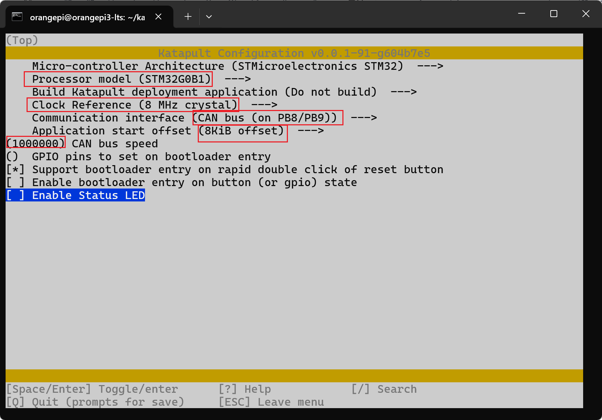
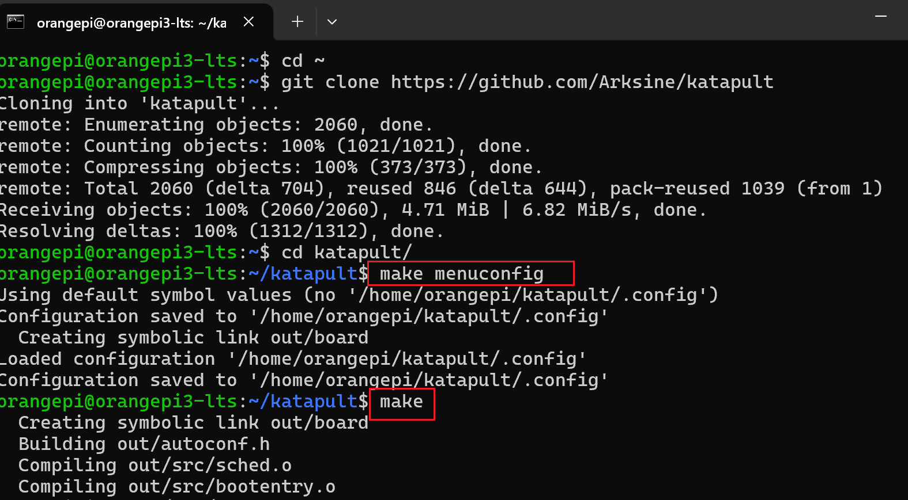
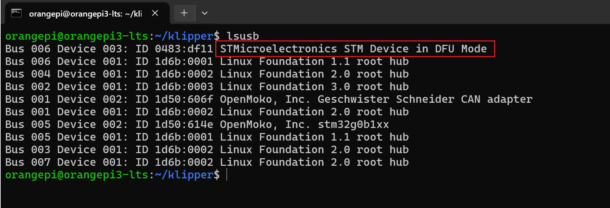
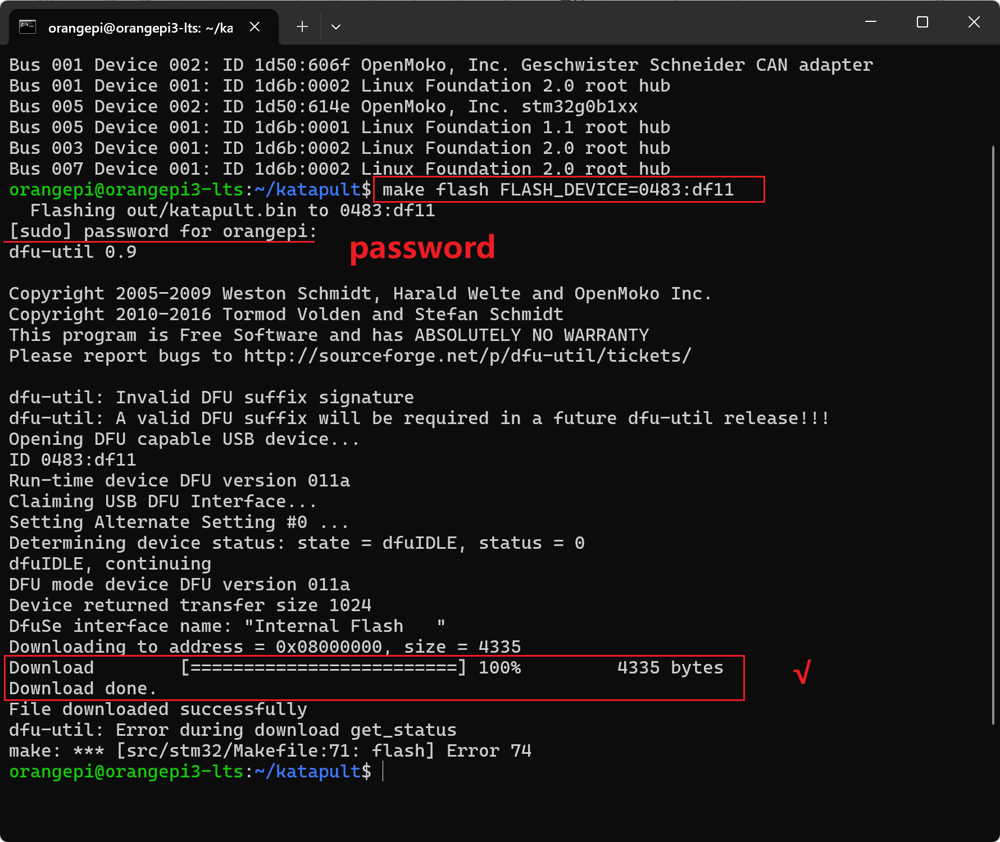
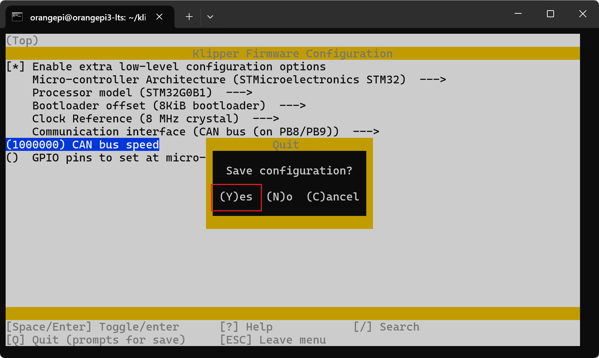
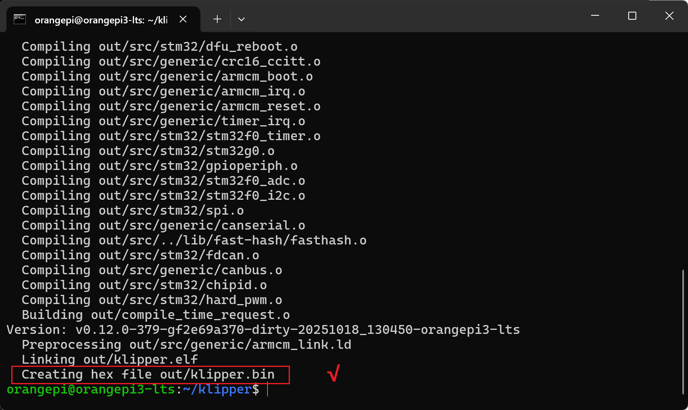
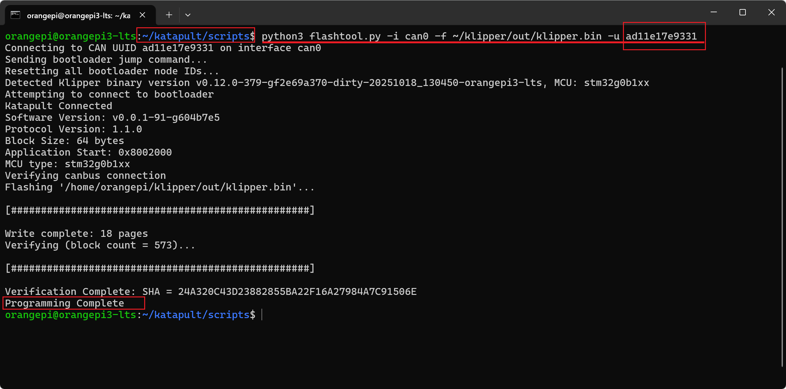
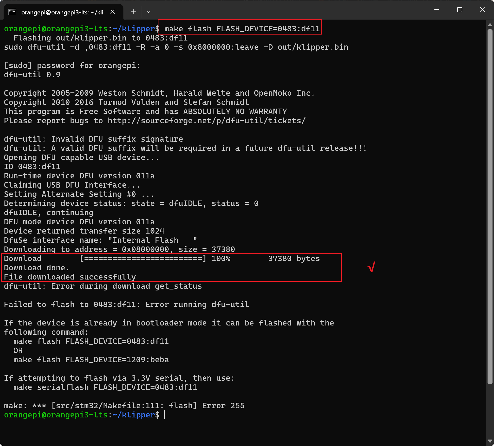
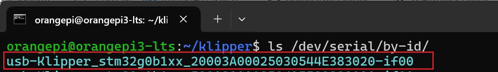

# TZB V1主板说明书

[English](README.md) | 中文


## **1.** 简介

**TZB主板 V1版本** ，是为兔子多色ERCF开发的一款专用主板。

 

它具有以下特点：

​                ● 主芯片采用 STM32G0B1CBT6 MCU 

​                ● 支持USB 串口和CAN接口连接

​                ● 2 个 基于 TMC2209 的电机插槽，为UART模式，支持无限位Diag

​                ● 5V接口可提供 5A 大电流，优化电感电容散热确保舵机和LED供电充足稳定

​                ● 两个镜像的2x7P的 XHD2.0接口，方便ERCFV3中两组微动的并联，简化接线

​                ● 所有的丝印标注都在正面，方便使用

​                ● 1 x RGB LED 连接器

​                ● 2 x 舵机接口，正常可以带动远程切刀

​                ● 1 x Binky 编码器接口

​                ● 16 x 微动开关控制连接器，充分使用接口的话可以支持到16色的ERCF

​                ● 1 x i2c接口，采用硬件i2c接口，可以用于连接温湿度计

​                ● 1 x 24V GND 接口，可以用于给需要5V以上供电的远程切刀供电

​                ● 1 x CAN 的外接接口，可用于并联其它主板，比如被动箱体主板

​                ● 1 x ADC接口，用于使用模拟霍尔元件的线性比例同步缓冲器

  

## 2. PIN图

本主板接线图全部在正面，一目了然，无需另外的PIN图


## 3.    **刷机教程**

 

### 3.1 烧录katapult **(可选)**

仅使用CAN连接且希望后续方便按`Reset`按键快速升级固件的用户可选择刷写`katapult`(之前名称为`Canboot`)。

不管使用can还是usb连接，canboot都不是必须的。

```
# 进入家目录
cd ~
 
# 下载katapult（已有的略过）
git clone https://github.com/Arksine/katapult
 
# 进入katapult目录
cd katapult
```


```
# 清除上次的编译
make clean
 
#修改编译配置，按下面图中参数填写
make menuconfig
 
#核对无误后，按q 退出，选择y ,然后输入make开始编译
make
```



**速率可以根据自己的需要进行设置，推荐`1000000.`**





编译之后会在 `~/katapult/out` 文件夹下生成`katapult.bin`

 

 

**进DFU模式** 

使用跳线短接5V USB跳线，短接后即可使用USB对主板进行供电刷机，**刷机结束记得拔掉跳线。**

如果使用24V进行供电则不需要短接，但是只能使用下面的方法二进入DFU。


进入DFU方法一：主板完全断电后，按住Boot，使用TypeC线将主板接到上位机，然后松开Boot 

进入DFU方法二：如果主板不断电，那就使用TypeC线连接到上位机后，先按住Boot，再按下Reset按键，松开Reset按键，最后松开Boot按键 


然后使用lsusb命令查看是否有DFU的设备

```
lsusb
```




使用下面的命令刷机

```
make flash FLASH_DEVICE=0483:df11
```




 烧录完成后请拔下USB线，连接can信号线和24V供电。

**注意1：记得拔掉5V USB跳线。**

**注意2：如果有多个can设备，只需要在一个设备上将120欧进行短接，最好选择最远的主板短接120欧姆。**

**注意3：注意24V GND CAN-H CAN-L的线序，仔细核对，线序错误可能造成主板烧毁，后果自负。**


使用下面的命令查看can的UUID,**[可能需要快速双击reset按键两次才能进入]**

```
~/klippy-env/bin/python ~/klipper/scripts/canbus_query.py can0
```


 

### 3.2  编译Klipper固件

ssh登录到上位机

```
# cd 到klipper目录
cd ~/klipper
 
# 清除上次的编译
make clean
 
# 配置编译参数[参考下图]
make menuconfig
```


  

根据自己需要使用的协议设置编译参数


```
# 如果不使用 Katapult
Bootloader offset (No bootloader) --->
 
# 如果使用 Katapult
Bootloader offset (8KiB bootloader) --->
 
# 如果使用 Type-C 上的 USB 通信
Communication interface (USB (on PA11/PA12)) --->
 
# 如果使用 CANBus 通信
Communication interface (CAN bus (on PD0/PD1)) --->
 (1000000) CAN bus speed 
```

 

按q退出，y保存




输入make命令开始编译

```
make
```




  

### 3.3  通过katapult进行固件更新

连接can信号线和24V供电。

**注意1：记得拔掉5V USB跳线。**

**注意2：如果有多个can设备，只需要在一个设备上将120欧进行短接**

**注意3：注意24V GND CAN-H CAN-L的线序，仔细核对，线序错误可能造成主板烧毁，后果自负。**


然后使用下面的命令参看uuid：

```
~/klippy-env/bin/python ~/klipper/scripts/canbus_query.py can0
```


 

使用下面的命令在can模式下进行刷机

```
cd ~/katapult/scripts
 
python3 flashtool.py -i can0 -f ~/klipper/out/klipper.bin -u 替换为你的UUID
```



 

然后继续使用前面的命令查看can的信息


**以后需要升级can固件的话就重复此过程，前面在编译canboot固件的时候设置了双击reset进入canboot模式**

**实际使用中，也可以直接输入刷机命令，板子会自动重启进入canboot。**


### 3.4  通过DFU进行固件更新

 

1：进dfu模式 

使用跳线短接5V USB跳线，短接后即可使用USB对主板进行供电刷机，**刷机结束记得拔掉跳线。**

如果使用24V进行供电则不需要短接，但是只能使用下面的方法二进入DFU。

进入DFU方法一：主板完全断电后，按住Boot，使用TypeC线将主板接到上位机，然后松开Boot 

进入DFU方法二：如果主板不断电，那就使用TypeC线连接到上位机后，先按住Boot，再按下Reset按键，松开Reset按键，最后松开Boot按键 

 

 

2：在ssh里输入lsusb查看是否出现dfu设备，正常就会出现dfu设备，

没有出现dfu就重新操作一次


 

3：在ssh里输入 

```
# 确保在klipper目录下
cd ~/klipper
 
# 0483:df11 为前面lsusb查到的id
# 提示找不到make，使用sudo apt install dfu-util -y  安装一下
 
make flash FLASH_DEVICE=0483:df11
```


然后就会进行烧录操作【可能需要输入密码】，等进度条走完并出现successfully就说明烧录成功了，successfully

后面的报错不必理会。



刷机完毕

 

4：**获取串口id**

重新拔插usb数据线，使用lsusb查看下有没有stm32f446 的设备

使用下面的命令查看下设备串口id

```
ls /dev/serial/by-id/
```



 

此设备的设备串口id为

```
serial: /dev/serial/by-id/usb-Klipper_stm32g0b1xx_20003A00025030544E383020-if00
```

**后期使用请拔掉5V USB 跳线，并在can接口接入24V 供电**

 

 

## 4.  ERCF多色接线图

 


## 5. 快乐兔软件配置

安装之后需要去mmu/base/mmu.cfg 文件中修改pin的相关内容，复制下面的内容覆盖对应内容即可【适配HH3.2以上版本】

HappyHare的适配正在进行


```
#TZB V1.0
[board_pins mmu]
mcu: mmu # Assumes using an external / extra mcu dedicated to MMU
aliases:
    MMU_GEAR_UART=PD1,
    MMU_GEAR_STEP=PD0,
    MMU_GEAR_DIR=PA15,
    MMU_GEAR_ENABLE=PD3,
    MMU_GEAR_DIAG=PD2,

    MMU_GEAR_UART_1=,
    MMU_GEAR_STEP_1=,
    MMU_GEAR_DIR_1=,
    MMU_GEAR_ENABLE_1=,
    MMU_GEAR_DIAG_1=,

    MMU_GEAR_UART_2=,
    MMU_GEAR_STEP_2=,
    MMU_GEAR_DIR_2=,
    MMU_GEAR_ENABLE_2=,
    MMU_GEAR_DIAG_2=,

    MMU_GEAR_UART_3=,
    MMU_GEAR_STEP_3=,
    MMU_GEAR_DIR_3=,
    MMU_GEAR_ENABLE_3=,
    MMU_GEAR_DIAG_3=,

    MMU_SEL_UART=PB5,
    MMU_SEL_STEP=PB4,
    MMU_SEL_DIR=PB3,
    MMU_SEL_ENABLE=PB7,
    MMU_SEL_DIAG=PB6,
    MMU_SEL_ENDSTOP=PA4,
    MMU_SEL_SERVO=PA0,


    MMU_ENCODER=PA2,
    MMU_GATE_SENSOR=,
    MMU_NEOPIXEL=PA5,

    MMU_PRE_GATE_0=PB14,
    MMU_PRE_GATE_1=PB13,
    MMU_PRE_GATE_2=PB12,
    MMU_PRE_GATE_3=PA7,
    MMU_PRE_GATE_4=PA6,
    MMU_PRE_GATE_5=PB2,
    MMU_PRE_GATE_6=PA13,
    MMU_PRE_GATE_7=PA10,
    MMU_PRE_GATE_8=,
    MMU_PRE_GATE_9=,
    MMU_PRE_GATE_10=,
    MMU_PRE_GATE_11=,

    MMU_POST_GEAR_0=,
    MMU_POST_GEAR_1=,
    MMU_POST_GEAR_2=,
    MMU_POST_GEAR_3=,
    MMU_POST_GEAR_4=,
    MMU_POST_GEAR_5=,
    MMU_POST_GEAR_6=,
    MMU_POST_GEAR_7=,
    MMU_POST_GEAR_8=,
    MMU_POST_GEAR_9=,
    MMU_POST_GEAR_10=,
    MMU_POST_GEAR_11=,

    MMU_ESPOOLER_RWD_0={espooler_rwd_0_pin},
    MMU_ESPOOLER_FWD_0={espooler_fwd_0_pin},
    MMU_ESPOOLER_EN_0={espooler_en_0_pin},
    MMU_ESPOOLER_TRIG_0=,
    MMU_ESPOOLER_RWD_1={espooler_rwd_1_pin},
    MMU_ESPOOLER_FWD_1={espooler_fwd_1_pin},
    MMU_ESPOOLER_EN_1={espooler_en_1_pin},
    MMU_ESPOOLER_TRIG_1=,
    MMU_ESPOOLER_RWD_2={espooler_rwd_2_pin},
    MMU_ESPOOLER_FWD_2={espooler_fwd_2_pin},
    MMU_ESPOOLER_EN_2={espooler_en_2_pin},
    MMU_ESPOOLER_TRIG_2=,
    MMU_ESPOOLER_RWD_3={espooler_rwd_3_pin},
    MMU_ESPOOLER_FWD_3={espooler_fwd_3_pin},
    MMU_ESPOOLER_EN_3={espooler_en_3_pin},
    MMU_ESPOOLER_TRIG_3=,
 
```


## 6.  I2C温湿度配置

如果你想连接I2C温湿度计，以BME280为例，你可以按下面进行设置

如下设置会使用硬件I2C从而节省处理器资源

```
[temperature_sensor MMU_enclosure]
sensor_type: BME280
i2c_mcu: mmu
i2c_bus: i2c2_PB10_PB11
i2c_address: 118
```

 


 

 

 